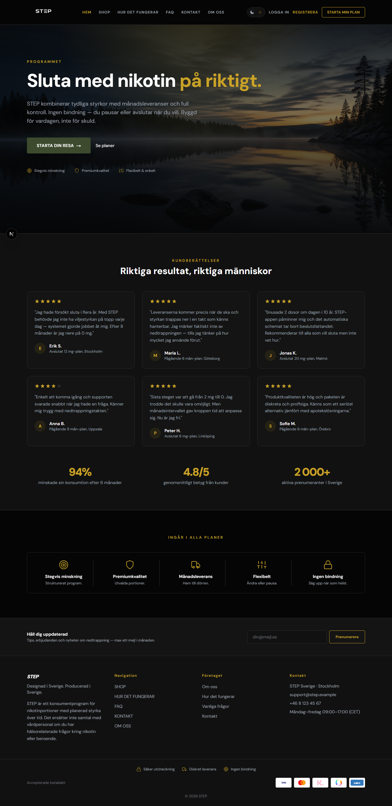
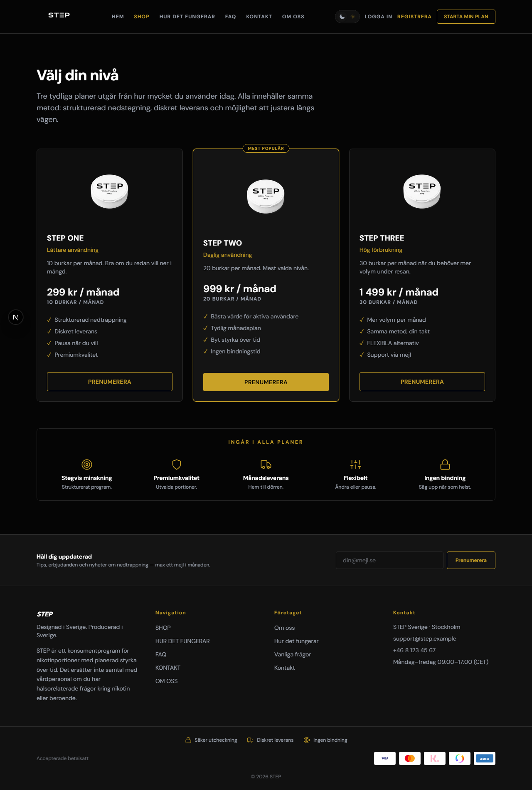
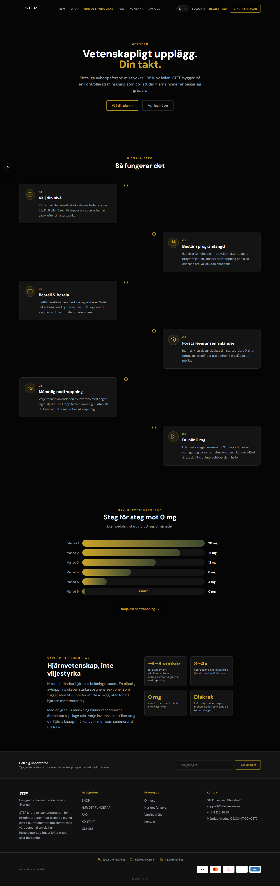
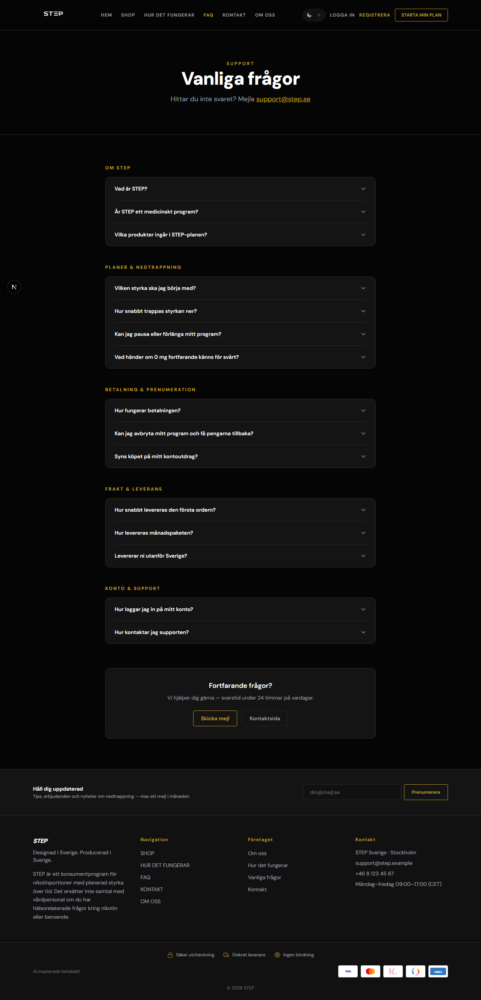
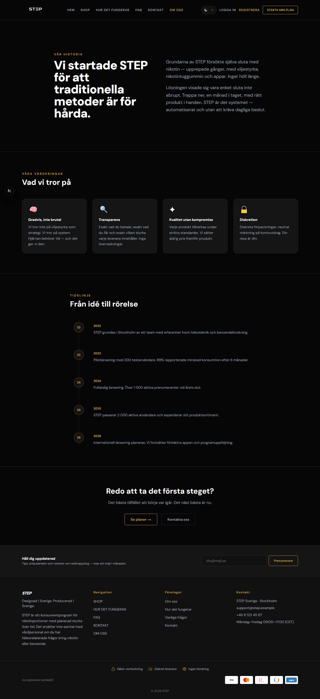
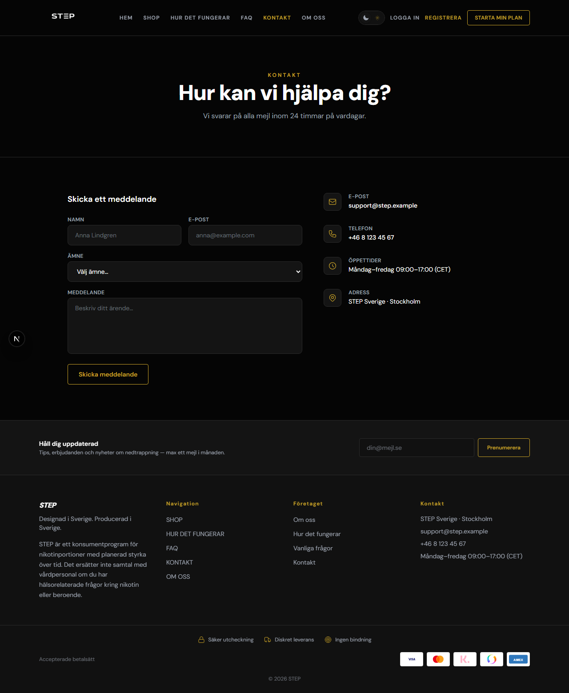
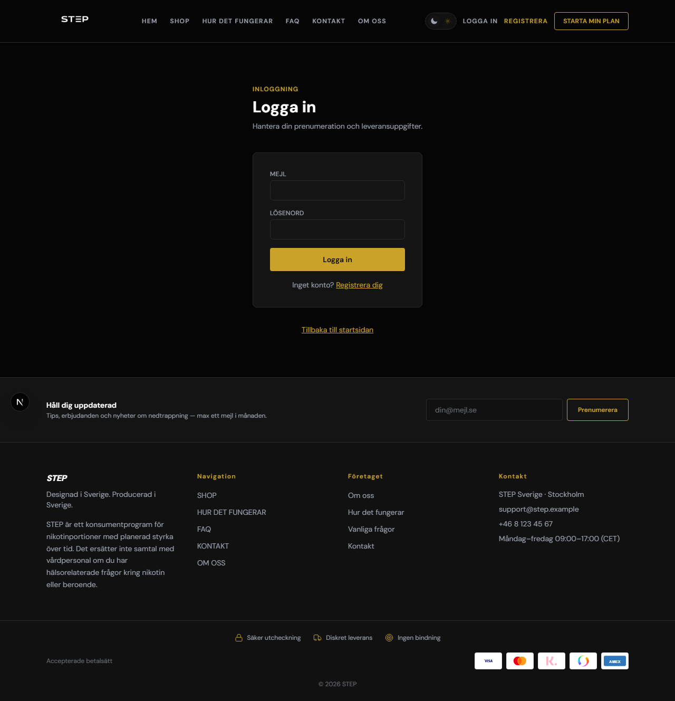
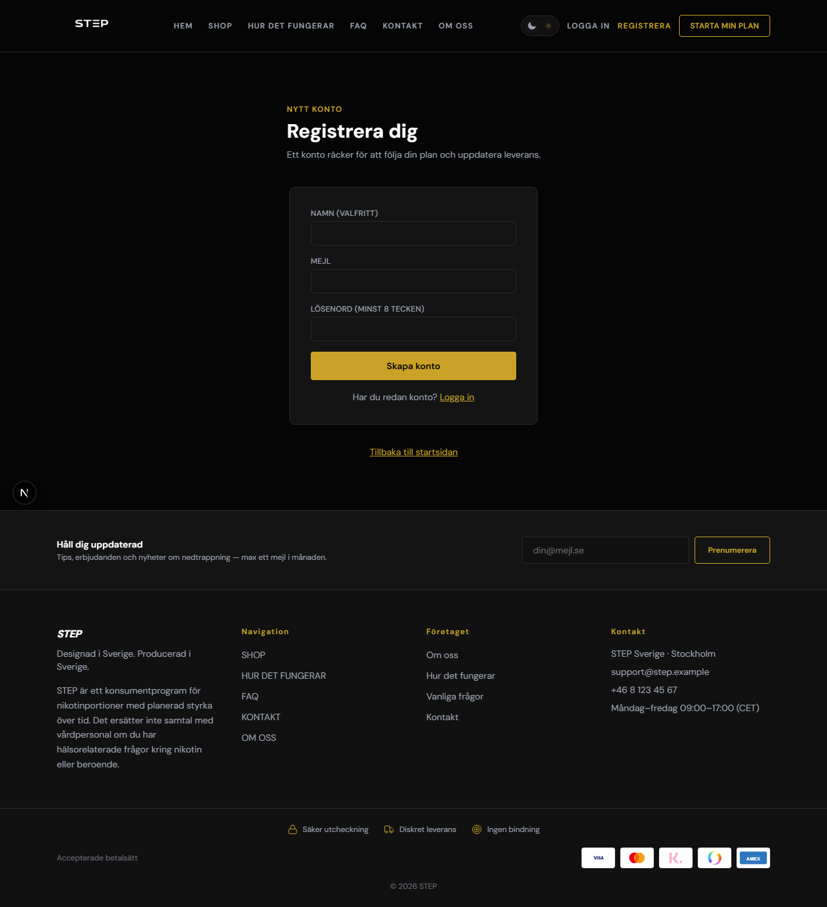
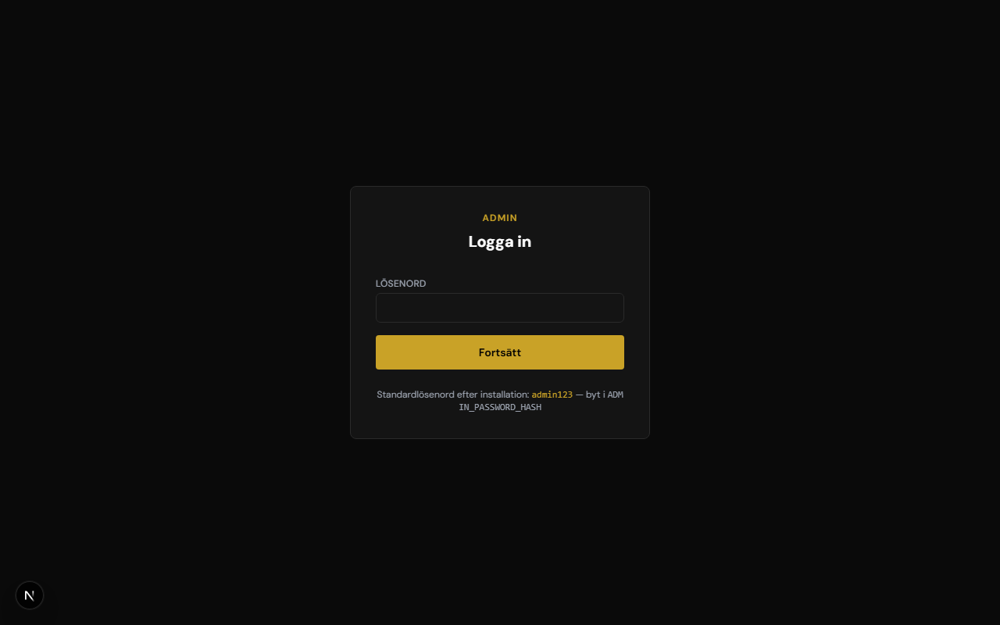

# STEP — Nikotinnedtrappning som prenumeration

> En full-stack Next.js-webbplats för ett nikotinnedtrappningsprogram. Kunder väljer sin startdos, programlängd och antal burkar per leverans. Systemet genererar ett automatiserat leveransschema som stegvis trappas ned mot 0 mg.

---

## Skärmdumpar

| Startsida | Shop |
|-----------|------|
|  |  |

| Hur det fungerar | FAQ |
|-----------------|-----|
|  |  |

| Om oss | Kontakt |
|--------|---------|
|  |  |

| Logga in | Registrera |
|----------|-----------|
|  |  |

| Admin-panel |
|-------------|
|  |

---

## Funktionsöversikt

### Publika sidor

| Sida | URL | Beskrivning |
|------|-----|-------------|
| Startsida | `/` | Hero med bakgrundsbild, logotyp, testimonials, förtroende-badges |
| Shop | `/shop` | Plantabell med alla aktiva planer och priser |
| Hur det fungerar | `/hur-det-fungerar` | Steg-för-steg-guide, nedtrappningskurva, vetenskap |
| FAQ | `/faq` | DB-driven FAQ med expanderbara frågor per kategori |
| Om oss | `/om-oss` | Varumärkeshistoria, värderingar, tidslinje |
| Kontakt | `/kontakt` | Kontaktformulär + kontaktuppgifter |

### Konto & Checkout

| Sida | URL | Beskrivning |
|------|-----|-------------|
| Registrera | `/auth/registrera` | Skapar konto, skickar välkomstmejl |
| Logga in | `/auth/logga-in` | Session-baserad autentisering |
| Konto | `/konto` | Kontoöversikt |
| Prenumeration | `/konto/prenumeration` | Aktiv prenumeration, leveranskalender, pausa/avsluta |
| Profil | `/konto/profil` | Adress, telefon, leveransinstruktioner |
| Säkerhet | `/konto/sakerhet` | Byt lösenord |
| Checkout | `/checkout/[planId]` | Flerstegskassa: kontaktinfo, adress, plankonfig, betalsätt |
| Orderbekräftelse | `/checkout/[planId]/bekraftelse` | Bekräftelsesida med leveransschema |
| Swish-betalning | `/betala/swish` | QR-kod + deeplink + realtids-polling |

### Admin-panel (`/admin`)

| Sida | Funktion |
|------|----------|
| Översikt | Statistik: prenumeranter, ordrar, användare |
| Prenumerationer | Visa/hantera alla prenumerationer, leveranstidslinje, spårningsnummer |
| Ordrar | Betalningsstatus, klickbar detaljsida per order (adress, plan, leveranser) |
| Användare | Visa, banna/avbanna kunder |
| Nyhetsbrev | Lista prenumeranter, exportera CSV, skicka nyhetsbrev till alla eller utvalda |
| Betalningsmetoder | Konfigurera Stripe, Klarna, Swish (API-nycklar + certifikat) |
| Planer | Skapa/redigera/ta bort prenumerationsplaner |
| Förtroenderad | Redigera trust-badges på startsidan |
| Sidor (CMS) | Skapa anpassade sidor med HTML-innehåll |
| Webbplats | Alla text-inställningar: hero, SEO, kontaktuppgifter |
| Meny | Hantera header-navigation |

---

## Tech Stack

| Kategori | Teknologi |
|----------|-----------|
| Framework | [Next.js 16](https://nextjs.org) (App Router) |
| Styling | [Tailwind CSS v4](https://tailwindcss.com) |
| Databas | SQLite via [Prisma](https://prisma.io) + `better-sqlite3` |
| Auth | [NextAuth.js](https://next-auth.js.org) (credentials) |
| Betalningar | Stripe Checkout, Swish Handel API (mTLS), Klarna |
| E-post | [Resend](https://resend.com) med HTML-mallar |
| Teman | [`next-themes`](https://github.com/pacocoursey/next-themes) (dark/light) |
| QR-koder | [`qrcode`](https://www.npmjs.com/package/qrcode) (Swish-betalning) |
| Bildbehandling | [`sharp`](https://sharp.pixelplumbing.com) |

---

## Kom igång — lokal installation

> Dessa steg fungerar på **Windows, macOS och Linux**.  
> Du behöver **Node.js 18+** och **npm** installerat.  
> Ladda ned Node.js här om du inte har det: https://nodejs.org

### 1. Klona projektet

Öppna en terminal och kör:

```bash
git clone https://github.com/DevFelikz/step-website.git
cd step-website/website
```

### 2. Installera beroenden

```bash
npm install
```

### 3. Skapa miljövariabelfilen

Skapa en fil som heter `.env` i mappen `website/` och klistra in följande.  
Du **måste** fylla i `SESSION_SECRET` och `ADMIN_PASSWORD_HASH` — resten är valfritt för grundläggande lokal körning.

```env
# ── Databas ────────────────────────────────────────────────────────
DATABASE_URL="file:./dev.db"

# ── Session (minst 32 slumpmässiga tecken) ─────────────────────────
# Generera ett säkert värde med: node -e "console.log(require('crypto').randomBytes(32).toString('hex'))"
SESSION_SECRET="byt-ut-detta-till-en-lång-hemlig-nyckel-minst-32-tecken"

# ── Admin-lösenord ─────────────────────────────────────────────────
# Generera en bcrypt-hash av ditt valda lösenord:
#   node -e "const b=require('bcryptjs'); b.hash('dittlösenord',10).then(console.log)"
ADMIN_PASSWORD_HASH=$2b$10$XXXXXXXXXXXXXXXXXXXXXXXXXXXXXXXXXXXXXXXXXXXXXXXXXXXX

# ── Stripe (valfritt — krävs för kortbetalning) ────────────────────
STRIPE_SECRET_KEY=sk_test_...
STRIPE_WEBHOOK_SECRET=whsec_...
NEXT_PUBLIC_STRIPE_PUBLISHABLE_KEY=pk_test_...

# ── Resend (valfritt — krävs för att skicka mejl) ──────────────────
RESEND_API_KEY=re_...
RESEND_FROM_EMAIL=no-reply@dindomän.se

# ── Publik URL (krävs för Swish callback i produktion) ─────────────
NEXT_PUBLIC_SITE_URL=http://localhost:3000
```

#### Generera SESSION_SECRET (ett kommando):

**Windows (PowerShell):**
```powershell
node -e "console.log(require('crypto').randomBytes(32).toString('hex'))"
```

**macOS / Linux:**
```bash
node -e "console.log(require('crypto').randomBytes(32).toString('hex'))"
```

#### Generera ADMIN_PASSWORD_HASH:

```bash
node -e "const b=require('bcryptjs'); b.hash('dittLösenord123',10).then(h=>console.log(h))"
```

Kopiera hela outputen (börjar med `$2b$10$...`) och klistra in som värde för `ADMIN_PASSWORD_HASH`.

### 4. Sätt upp databasen

```bash
npx prisma generate
npx prisma db push
```

Detta skapar filen `dev.db` med alla databastabeller.

### 5. Starta utvecklingsservern

```bash
npm run dev
```

Öppna **http://localhost:3000** i webbläsaren.

### 6. Logga in i admin-panelen

Gå till **http://localhost:3000/admin** och logga in med:
- **Användarnamn:** `admin`
- **Lösenord:** det du satte i `ADMIN_PASSWORD_HASH` (klartextvärdet du hashade)

Härifrån kan du lägga till planer, redigera sitetext, konfigurera betalningar m.m.

---

## Produktionsbygge

```bash
npm run build    # Kompilerar projektet
npm start        # Startar produktionsservern på port 3000
```

---

## Driftsättning på VPS (Ubuntu / Debian)

> Delade webbhotell (som Loopias billigaste planer) stödjer inte Node.js.  
> Du behöver en **VPS** — t.ex. **Loopia VPS**, DigitalOcean, Hetzner eller liknande.  
> Minst 1 vCPU + 1 GB RAM räcker för detta projekt.

### Steg 1 — Logga in på servern via SSH

Öppna en terminal (Windows: PowerShell, Mac/Linux: Terminal) och kör:

```bash
ssh root@DIN-SERVER-IP
```

Skriv in det lösenord Loopia (eller din VPS-leverantör) skickade till dig.

---

### Steg 2 — Installera Node.js, nginx och PM2

```bash
# Uppdatera systemet
apt update && apt upgrade -y

# Installera verktyg
apt install -y curl git nginx

# Installera Node.js 20
curl -fsSL https://deb.nodesource.com/setup_20.x | bash -
apt install -y nodejs

# Installera PM2 (håller igång appen)
npm install -g pm2

# Verifiera
node --version   # ska visa v20.x.x
```

---

### Steg 3 — Ladda ner projektet från GitHub

```bash
cd /var/www
git clone https://github.com/DevFelikz/step-website.git
cd step-website/website
npm install
```

---

### Steg 4 — Skapa miljövariabelfilen

```bash
nano .env
```

Klistra in och fyll i med dina **riktiga** värden (se miljövariabler ovan för förklaring):

```env
DATABASE_URL="file:./prod.db"
SESSION_SECRET="kör-kommandot-nedan-för-att-generera"
ADMIN_PASSWORD_HASH=$2b$10$...hash-genererad-nedan...

STRIPE_SECRET_KEY=sk_live_...
STRIPE_WEBHOOK_SECRET=whsec_...
NEXT_PUBLIC_STRIPE_PUBLISHABLE_KEY=pk_live_...

RESEND_API_KEY=re_...
RESEND_FROM_EMAIL=no-reply@dindomän.se

NEXT_PUBLIC_SITE_URL=https://dindomän.se
```

Spara med `Ctrl+O` → Enter → `Ctrl+X`.

**Generera SESSION_SECRET:**
```bash
node -e "console.log(require('crypto').randomBytes(32).toString('hex'))"
```

**Generera ADMIN_PASSWORD_HASH:**
```bash
node -e "const b=require('bcryptjs'); b.hash('DittLösenord',10).then(console.log)"
```

---

### Steg 5 — Bygg och starta appen

```bash
# Skapa databasen
npx prisma generate
npx prisma db push

# Bygg produktionsversionen
npm run build

# Starta med PM2
pm2 start npm --name "step-website" -- start

# Starta automatiskt vid serveromstart
pm2 startup
pm2 save
```

Kontrollera att appen kör:
```bash
pm2 status          # ska visa "online"
curl localhost:3000  # ska ge HTML-svar
```

---

### Steg 6 — Konfigurera nginx (koppla domänen till appen)

```bash
nano /etc/nginx/sites-available/step
```

Klistra in (byt ut `dindomän.se` mot din riktiga domän):

```nginx
server {
    listen 80;
    server_name dindomän.se www.dindomän.se;

    location / {
        proxy_pass         http://localhost:3000;
        proxy_http_version 1.1;
        proxy_set_header   Upgrade $http_upgrade;
        proxy_set_header   Connection 'upgrade';
        proxy_set_header   Host $host;
        proxy_set_header   X-Real-IP $remote_addr;
        proxy_set_header   X-Forwarded-For $proxy_add_x_forwarded_for;
        proxy_set_header   X-Forwarded-Proto $scheme;
        proxy_cache_bypass $http_upgrade;
    }
}
```

```bash
# Aktivera konfigurationen
ln -s /etc/nginx/sites-available/step /etc/nginx/sites-enabled/

# Testa syntax
nginx -t

# Starta om nginx
systemctl restart nginx
```

---

### Steg 7 — Peka domänen mot servern (DNS)

Logga in på din domänleverantör (t.ex. Loopia kundzon → Mina domäner → DNS-inställningar) och lägg till:

| Typ | Namn | Värde |
|-----|------|-------|
| A | `@` | `DIN-SERVER-IP` |
| A | `www` | `DIN-SERVER-IP` |

> DNS-ändringar tar vanligtvis 15 min – 2 timmar att slå igenom.  
> Kontrollera med: `ping dindomän.se` — ska ge din server-IP.

---

### Steg 8 — SSL-certifikat (https://)

Vänta tills DNS slagit igenom, kör sedan:

```bash
# Ubuntu/Debian med snap (rekommenderas)
apt install -y snapd
snap install --classic certbot
ln -s /snap/bin/certbot /usr/bin/certbot

# Hämta och installera certifikat
certbot --nginx -d dindomän.se -d www.dindomän.se
```

Välj att **omdirigera HTTP → HTTPS** när det frågas (alternativ 2).  
Certbot förnyar automatiskt certifikatet var 90:e dag.

---

### Steg 9 — Konfigurera Stripe webhook (för betalningar)

1. Logga in på [dashboard.stripe.com](https://dashboard.stripe.com)
2. Gå till **Developers → Webhooks → Add endpoint**
3. Fyll i:
   - **URL:** `https://dindomän.se/api/stripe/webhook`
   - **Events:** välj `checkout.session.completed`
4. Kopiera **Signing secret** (`whsec_...`)
5. Uppdatera `.env` på servern:

```bash
cd /var/www/step-website/website
nano .env   # uppdatera STRIPE_WEBHOOK_SECRET
npm run build
pm2 restart step-website
```

---

### Uppdatera hemsidan i framtiden

När du gjort ändringar lokalt och pushat till GitHub:

```bash
cd /var/www/step-website/website
git pull
npm install
npm run build
pm2 restart step-website
```

---

### Felsökning

```bash
pm2 logs step-website       # felmeddelanden från Next.js
pm2 restart step-website    # starta om appen
systemctl status nginx      # nginx-status
systemctl restart nginx     # starta om nginx
```

---

## Projektstruktur

```
website/
├── prisma/
│   └── schema.prisma            # Alla databasmodeller
├── public/
│   ├── step-logo.png            # STEP-logotyp (transparent)
│   ├── swish-logo.png           # Swish-logotyp
│   └── hero-background.png      # Startsidans bakgrundsbild
├── src/
│   ├── app/
│   │   ├── page.tsx             # Startsida
│   │   ├── shop/                # Shoppsida med planer
│   │   ├── faq/                 # FAQ-sida (DB-driven)
│   │   ├── om-oss/              # Om oss
│   │   ├── kontakt/             # Kontaktsida + formulär
│   │   ├── hur-det-fungerar/    # Steg-för-steg-guide
│   │   ├── admin/               # Admin-panel (/admin/*)
│   │   │   └── (panel)/
│   │   │       ├── orders/      # Orderhantering + detaljsida
│   │   │       ├── newsletter/  # Prenumeranter + skicka nyhetsbrev
│   │   │       ├── payments/    # Betalningsleverantörskonfiguration
│   │   │       ├── plans/       # Planhantering
│   │   │       ├── settings/    # Webbplatsinställningar
│   │   │       └── ...
│   │   ├── api/
│   │   │   ├── stripe/          # Stripe checkout + webhook
│   │   │   ├── payments/swish/  # Swish request, callback, status
│   │   │   ├── contact/         # Kontaktformulär
│   │   │   └── newsletter/      # Nyhetsbrevssignup
│   │   ├── auth/                # Inloggning + registrering
│   │   ├── betala/swish/        # Swish betalningssida (QR + polling)
│   │   ├── checkout/            # Kassaflöde
│   │   └── konto/               # Användarkonto
│   ├── components/
│   │   └── site/                # Header, Footer, PlanCard, MobileNav, osv.
│   └── lib/
│       ├── db.ts                # Prisma-klient
│       ├── email.ts             # Resend e-postmallar
│       ├── paymentConfig.ts     # Betalningsleverantörer från DB
│       ├── planEngine.ts        # Genererar leveransschema
│       ├── siteSettings.ts      # Site-inställningar med fallback
│       ├── stripe.ts            # Stripe-klient
│       └── swish.ts             # Swish Handel API-klient (mTLS)
└── docs/
    └── screenshots/             # Skärmdumpar av alla sidor
```

---

## Databasmodeller

| Modell | Beskrivning |
|--------|-------------|
| `SiteSettings` | All redigerbar text (hero, SEO, kontaktinfo) |
| `User` | Kunder med adress, lösenordshash, ban-status |
| `Plan` | Prenumerationsplaner med priser och bullets |
| `Subscription` | Aktiv prenumeration per kund |
| `Delivery` | Enskilda leveranser i ett program med spårning |
| `Order` | Betalningspost kopplad till Stripe/Swish |
| `NavLink` | Header-navigering (admin-redigerbar) |
| `TrustItem` | Förtroende-badges |
| `FaqItem` | FAQ med kategori och sortering |
| `PaymentProvider` | Betalningsleverantörer med API-konfiguration |
| `NewsletterSubscriber` | E-postprenumeranter |
| `SentNewsletter` | Historik över skickade nyhetsbrev |
| `ContentPage` | Fria CMS-sidor |

---

## Betalningsflöden

### Stripe (Kort & Klarna)
1. Kund fyller i kassa → `submitCheckout` skapar `Subscription` + `Order` (PENDING)
2. Redirect → `/api/stripe/checkout` skapar Stripe Checkout Session
3. Kund betalar på Stripe → webhook `checkout.session.completed`
4. Webhook: Order → PAID, Subscription → ACTIVE, bekräftelsemejl skickas

### Swish Handel
1. Kund väljer Swish → skapar order → redirect `/betala/swish?orderId=xxx`
2. Server skapar betalningsförfrågan via mTLS mot Swish API
3. Sidan visar QR-kod + deeplink-knapp (för mobil)
4. Polling var 2:a sekund mot `/api/payments/swish/status`
5. Swish kallar `/api/payments/swish/callback` → Order → PAID + bekräftelsemejl

### Konfigurera betalningar (admin)
1. Gå till `/admin/payments`
2. Aktivera önskad leverantör (Stripe / Klarna / Swish)
3. Klistra in API-nycklar / certifikat
4. Spara — betalningsmetoden visas direkt i kassan

**Stripe webhook (lokal test):**
```bash
stripe listen --forward-to localhost:3000/api/stripe/webhook
```

**Swish certifikat — konvertera p12 → Base64:**
```bash
openssl base64 -in cert.p12 | tr -d '\n'
```

---

## E-posttriggers

| Händelse | Mall |
|----------|------|
| Ny kund registrerar sig | Välkomstmejl |
| Betalning bekräftad (Stripe/Swish) | Orderbekräftelse med leveransschema |
| Admin markerar leverans som skickad | Leveransavisering med spårningslänk |
| Admin skickar nyhetsbrev | HTML-nyhetsbrev via Resend batch API |

---

## Tema

Webbplatsen stödjer **mörkt och ljust läge** via `next-themes`. Admin-panelen är alltid mörk. Temat byts med toggle-knappen i headern.

CSS-variabler definierade i `globals.css`:
- `--color-step-bg`, `--color-step-surface`, `--color-step-card`
- `--color-step-gold`, `--color-step-border`, `--color-step-muted`
- `--color-step-ink` (förgrund)

---

## Licens

Privat projekt — alla rättigheter förbehållna.
